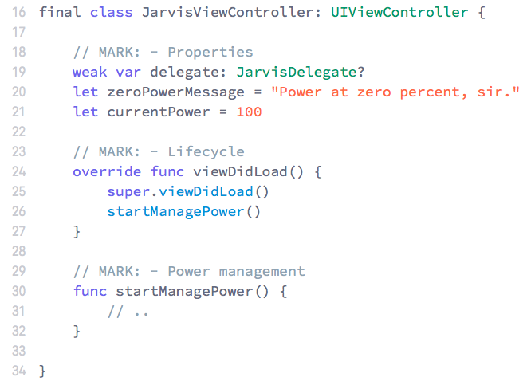
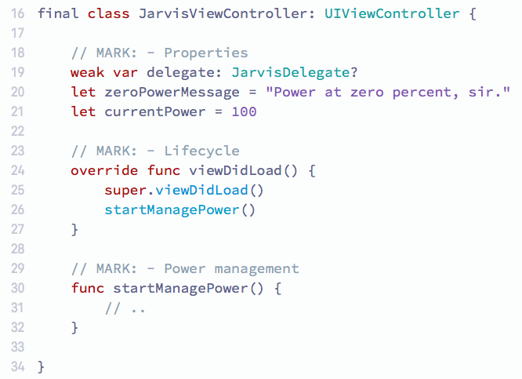
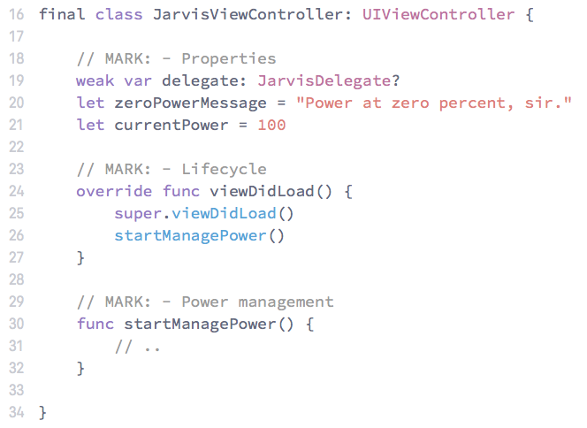
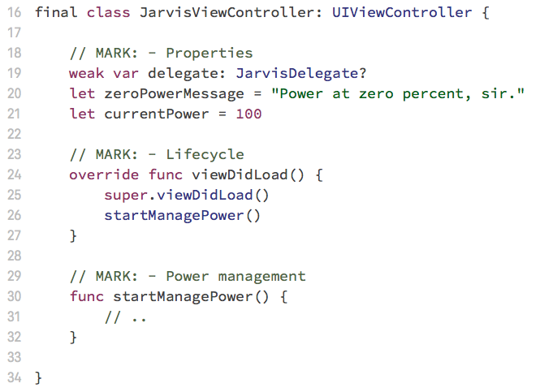
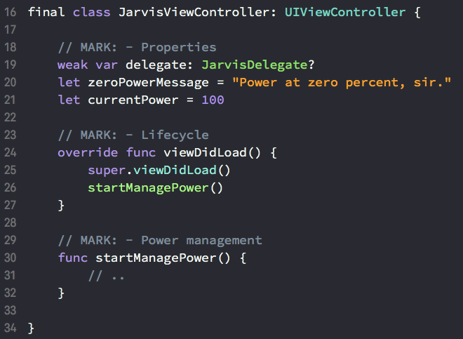
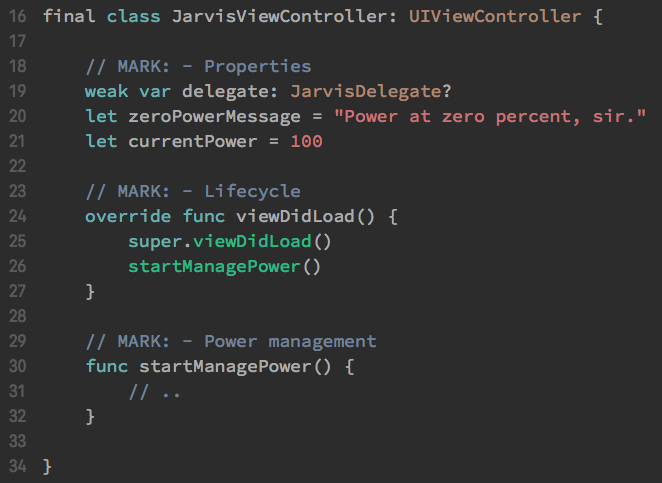
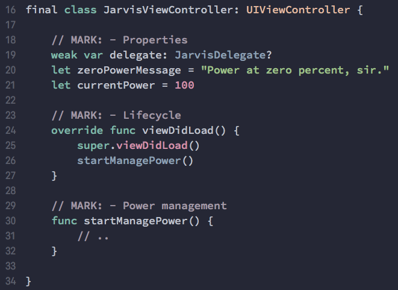

## Installation
Download and copy themes to this directory: `~/Library/Developer/Xcode/UserData/FontAndColorThemes/`

## Themes
Light:

- [Atlas](#atlas)
- [Frost Byte](#frost-byte)
- [Lotus](#lotus)
- [Low Tune](#low-tune)

Dark:
- [Nightcall](#nightcall)
- [Sepia](#sepia)
- [Spaceship](#spaceship)

### Atlas

### Frost Byte

### Lotus

### Low Tune

### Nightcall

### Sepia

### Spaceship

### Meta
- Used font - `Source Code Pro`
