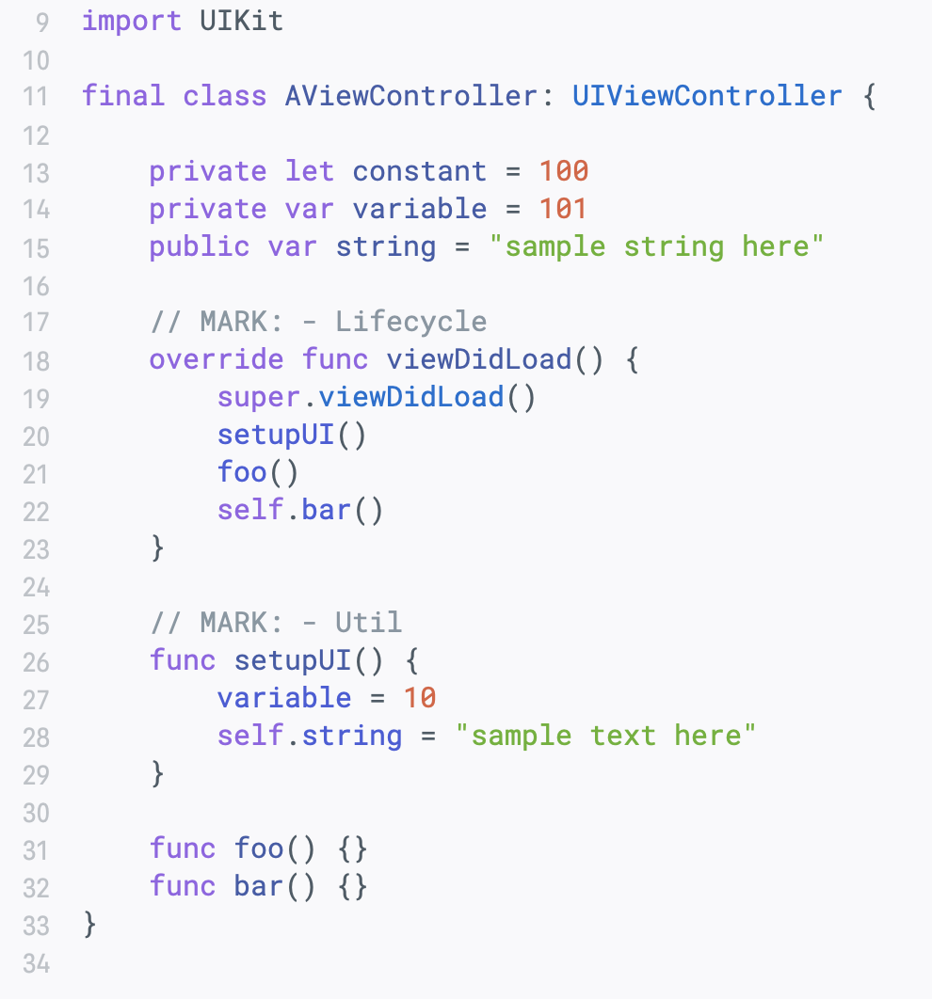
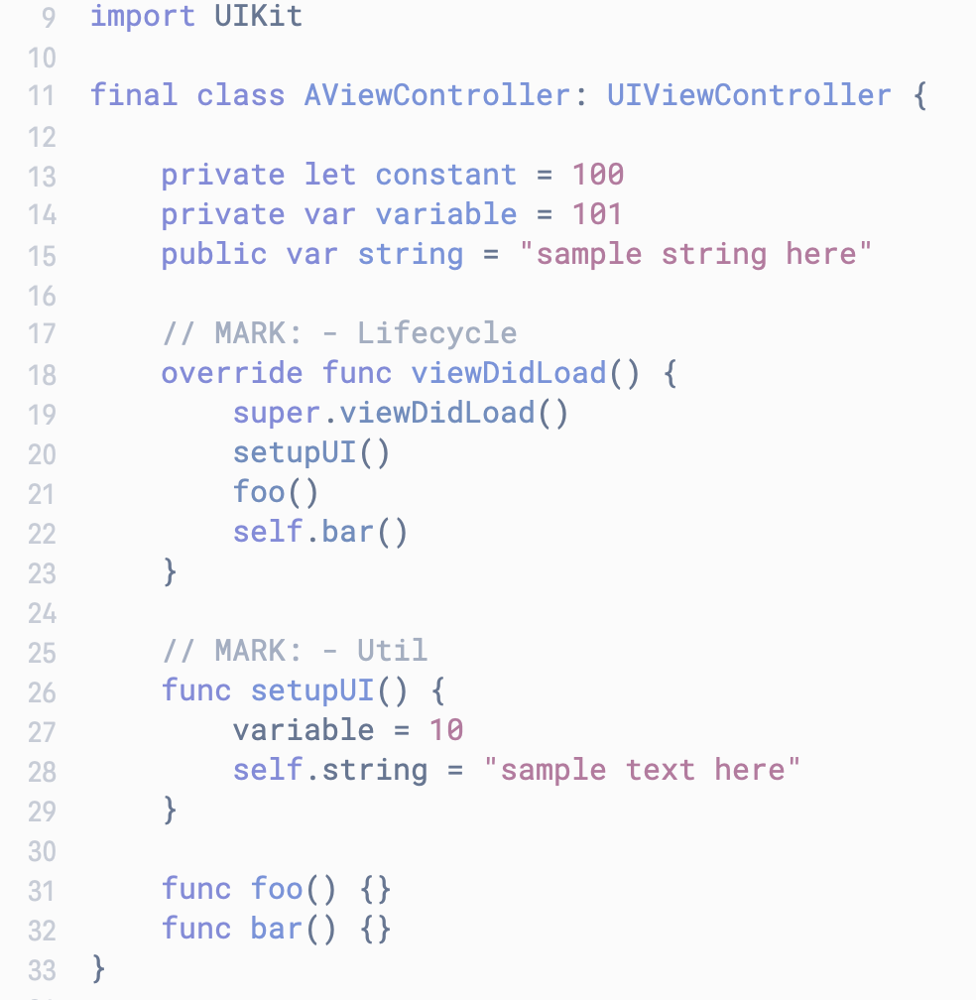
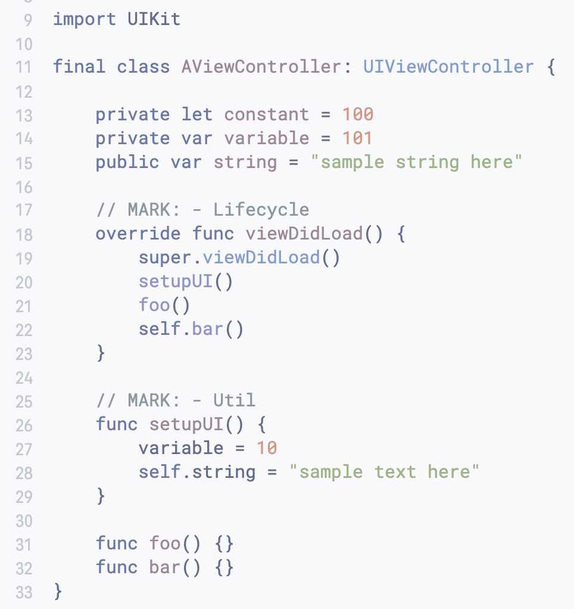
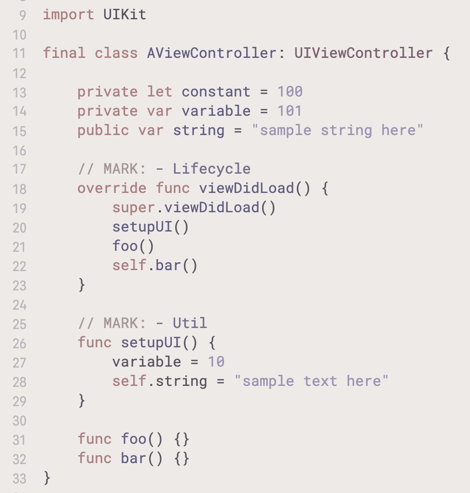
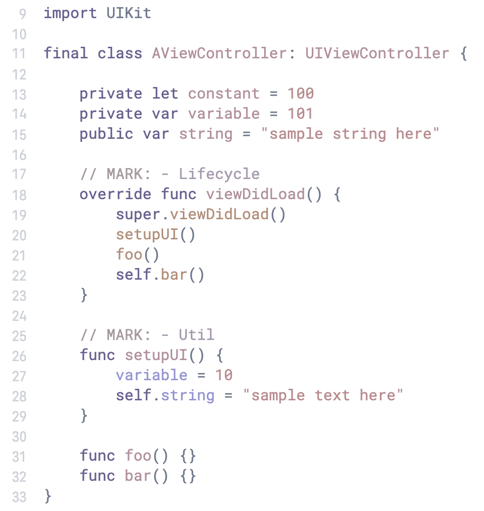
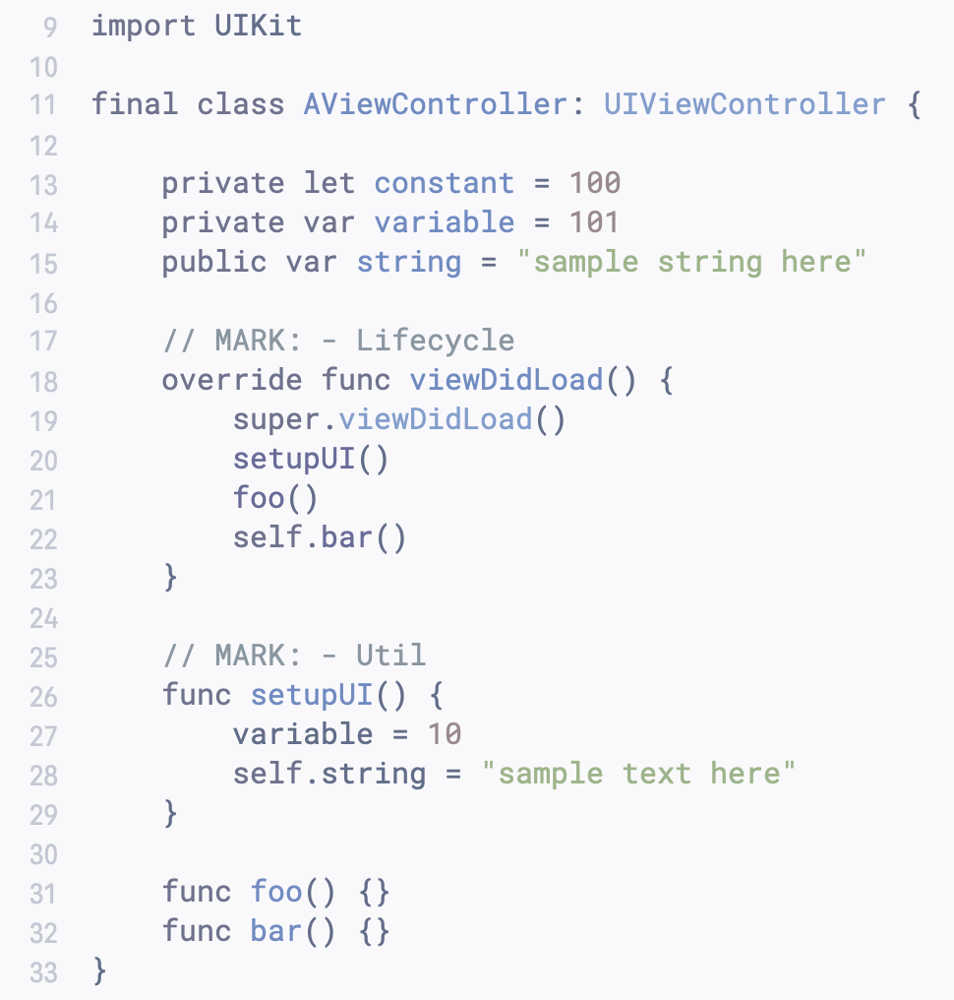
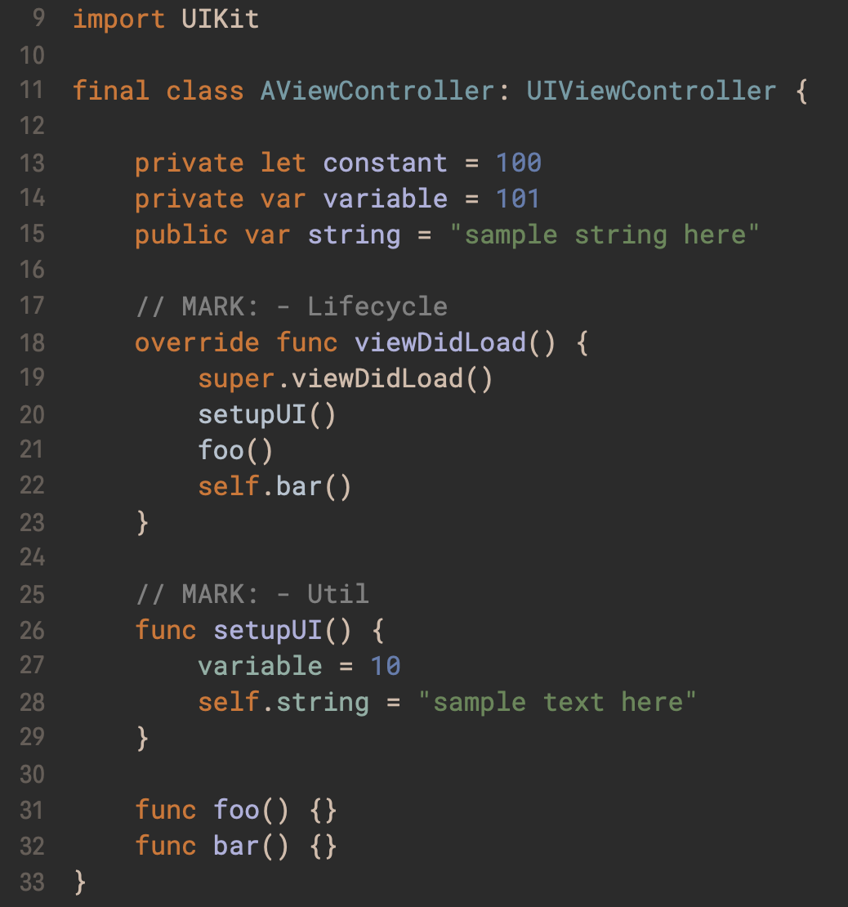
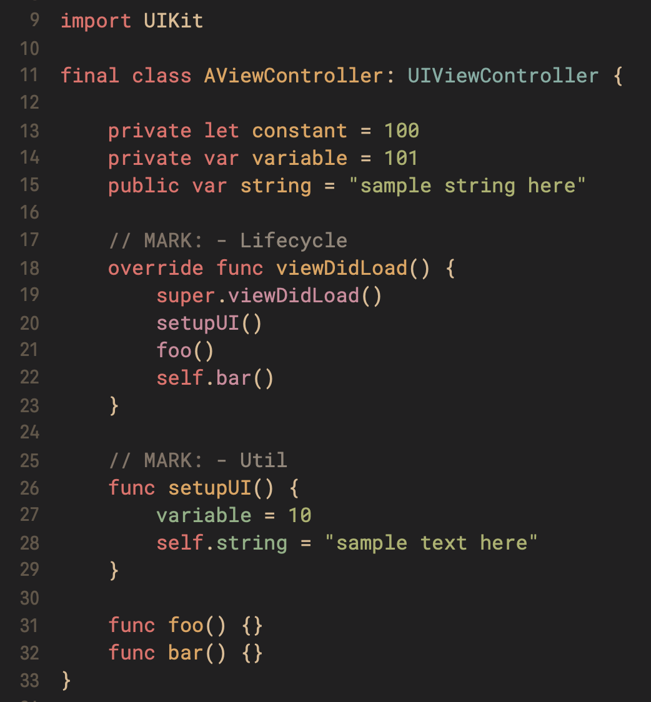
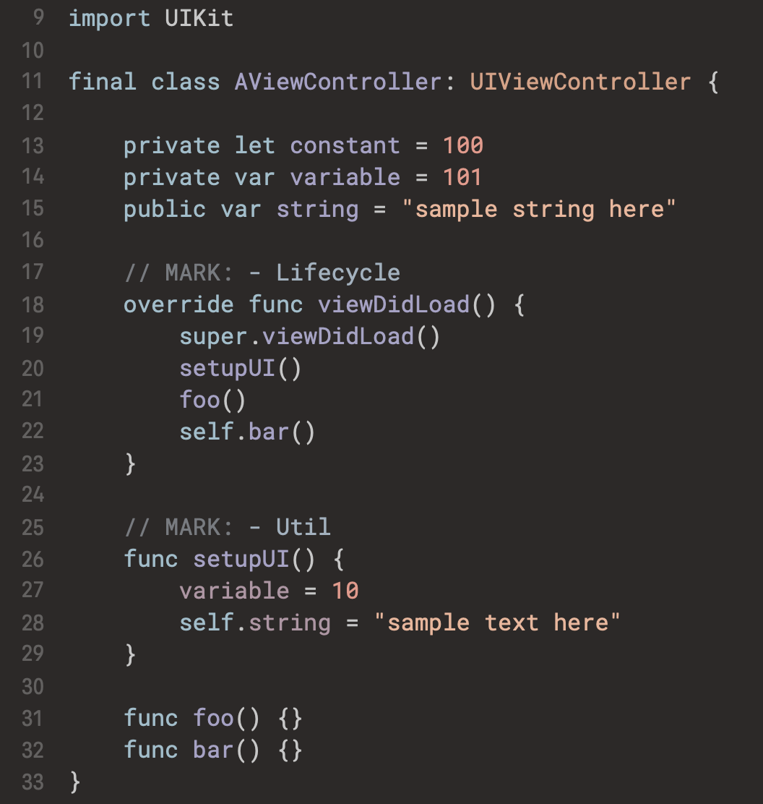
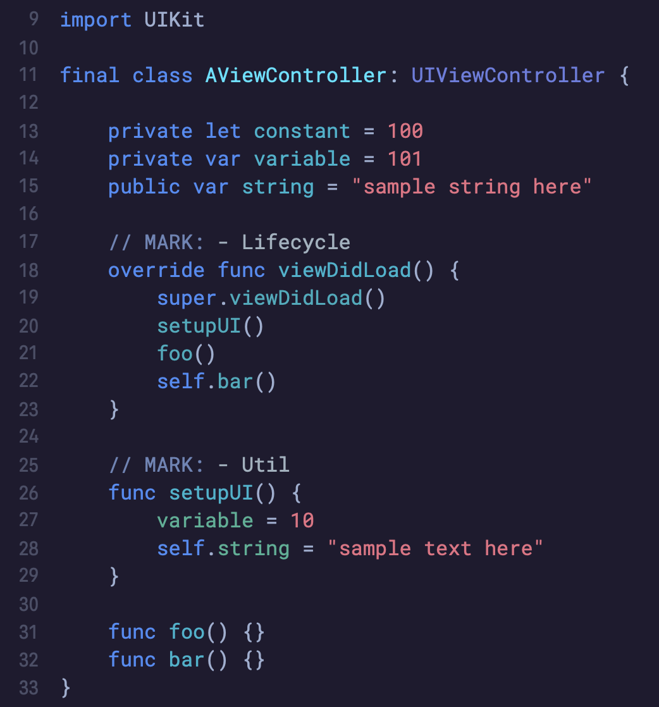

## Installation
Download and copy themes to this directory: `~/Library/Developer/Xcode/UserData/FontAndColorThemes/`

## Themes
Light:
- [Bright](#bright)
- [Fresh Breathe](#fresh-breathe)
- [Morning Fog](#morning-fog)
- [Paper Pastel](#paper-pastel)
- [Sensenati](#sensenati)
- [Silver](#silver)

Dark:
- [Darcula](#darcula)
- [Gruvbox](#gruvbox)
- [Horizon](#horizon)
- [Neon](#neon)

### Bright

### Fresh Breathe

### Morning Fog

### Paper Pastel

### Sensenati

### Silver

### Darcula

### Gruvbox

### Horizon

### Neon

### Meta
- Font - `Roboto Mono`
